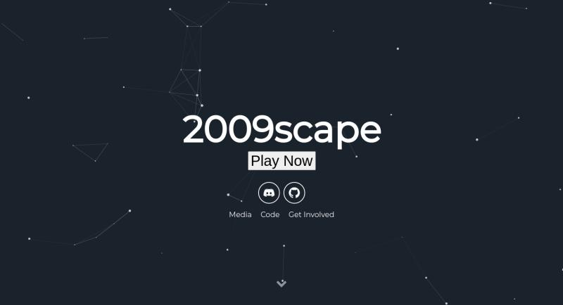

# 2009scape Website



A non-interactive website where you can host download links, community links, and whatever else you want too.

Features:

- Gulp
- SASS
- Sweet Scroll
- Particle.js
- BrowserSync
- Font Awesome and Devicon icons
- Google Analytics
- Info Customization

## Basic Setup

1. [Install Jekyll](http://jekyllrb.com)
2. Edit `_config.yml` to personalize the site.

## Site and User Settings

You have to fill some informations on `_config.yml` to customize your site.

```
# Site settings
description: A blog about lorem ipsum dolor sit amet
baseurl: "" # the subpath of your site, e.g. /blog/
url: "http://localhost:3000" # the base hostname & protocol for your site

# User settings
username: Lorem Ipsum
user_description: Anon Developer at Lorem Ipsum Dolor
user_title: Anon Developer
email: anon@anon.com
twitter_username: lorem_ipsum
github_username:  lorem_ipsum
gplus_username:  lorem_ipsum
```

**Don't forget to change your url before you deploy your site!**

## Color and Particle Customization
- Color Customization
  - Edit the sass variables
- Particle Customization
  - Edit the json data in particle function in app.js
  - Refer to [Particle.js](https://github.com/VincentGarreau/particles.js/) for help

## Running the blog in local

In order to compile the assets and run Jekyll on local you need to follow those steps:

- Install [NodeJS](https://nodejs.org/)
- Install [Jekyll](https://jekyllrb.com): `sudo gem install bundler jekyll`
- Install [Yarn](https://yarnpkg.com/): `npm install -g yarn`
- Install dependencies: `yarn`
- Run: `gulp`

## Credits

This project was taken from [Nathan Randecker](https://github.com/nrandecker/particle). Big thanks to him and his generous license.
